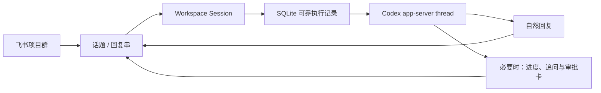

# Feishu Codex Console

[English](README.en.md) · [安装](docs/INSTALLATION.md) · [配置](docs/CONFIGURATION.md) · [兼容与升级](docs/COMPATIBILITY.md) · [Roadmap](ROADMAP.md)

把本地 Codex thread 映射成一个可持续交流、可以协作和接管的飞书工作会话。人在外面时，可以在飞书里继续提问、分析、写文件、修改代码、回答 Codex 追问并处理权限确认；本机不需要开放公网端口。

V5 直接连接 Codex `app-server`，不再把每条飞书消息当成一次孤立的 CLI 调用。私聊可以持续使用一个上下文；群聊顶层 prompt 会进入独立回复串，同一回复串持续绑定同一个项目和 Codex thread，因此多项目、多会话和团队接力不会混在一起。

## V5 有什么

- 一张自适应欢迎卡：成员第一次发消息时自动出现；离线时只给连接入口，未选项目时只让用户选项目，准备完成后直接给示例和“开始使用”，不再要求逐步点完向导。
- 本地设备控制台：一张 Card 2.0 展示飞书连接、Codex 引擎、账户额度摘要、当前项目、队列、电源和远程就绪状态；完整额度独立展开。
- 多项目工作台：同步 Codex 桌面端保存的项目，也可扫描额外 Git 根目录；显示路径、分支和未提交状态，并按成员保存收藏与最近使用。
- 模型控制中心：从 Codex 原生模型目录切换模型、推理强度和任务权限上限，下一轮真实生效；模型能力变化时安全回退。
- 会话与任务中心：浏览和恢复本人在当前项目的历史 thread、压缩上下文、查看本人任务并远程停止；管理员可查看全项目会话。
- 团队权限：管理员、操作者、只读成员、任务归属、卡片操作归属、项目 ACL 和 SQLite 审计日志。
- 丝滑追问：任务运行时直接发送普通消息会自动加入当前 turn；使用“排队”可明确创建独立任务。
- 工作区会话：群顶层 prompt 自动创建独立话题会话，后续回复通过 `root_id` 恢复同一个 Codex thread；项目和设置只在创建时复制，旧 thread 不会串入新话题。
- 自然意图分流：普通消息会自动区分问答、分析、内容写作和代码任务；问答/分析强制只读，只有代码任务默认要求测试证据。
- 自然回答：问答和只读分析使用一条可更新的 Markdown 消息，从处理态原地变成最终回答，不再出现绿色任务完成大卡片。
- 执行结果闭环：写文件和代码任务保留可控的运行卡、结果摘要与验证入口，默认不追加重复完成消息。
- 持久 Codex 会话：通过 `codex app-server` 执行、恢复、追加要求和中断 turn。
- 原生实时交互：Codex 的权限请求和问题会变成飞书按钮、下拉框或下一条消息输入，回答后原任务自动继续。
- 敏感输入保护：Codex 标记为秘密的问题不会在飞书提供答案入口，也不会转发到任务或写入内容日志。
- 分层实时呈现：普通回答更新同一条 Markdown；写文件和代码任务才展示排队、命令、文件修改和测试状态卡。
- 结果审阅中心：任务启动时建立 Git 基线，完成后展示测试证据、增删行、文件归因和分页 Diff；脏工作区不会被伪装成纯任务修改。
- 临时完全访问：完全访问不再永久保存，只能授权下一任务、30 分钟或当前会话，并绑定成员、项目和 Codex thread 后自动到期。
- 仓库安全策略：项目可用 `.feishu-codex-policy.json` 降低 sandbox 上限、限制可申请外部动作或直接拒绝部署等动作。
- 统一脱敏：日志、诊断、审计摘要、可靠文本回复、任务/审批/确认卡、测试摘要和 Diff 共享凭据脱敏规则。
- 产品化回复：普通交流使用飞书原生 Markdown；控制、审批、追问、长任务和异常才使用 Card 2.0，可靠文本作为最后降级。
- 可靠恢复：SQLite WAL 保存会话、项目、任务、CardKit 序号、确认记录和事件去重；重启后自动恢复尚未开始的排队任务，已经运行的任务不会被危险地自动重放。
- 自动备份与对账：数据库升级前创建校验快照，失败自动回滚；启动时保守修复任务记录、卡片和 Codex 启动证据的不一致。
- 可靠发送：飞书 API 限流、超时和临时失败会退避重试；终态卡片失败时通过 SQLite outbox 保证仍有结果。
- 远程就绪：macOS 上可从设备卡开启 `caffeinate`，降低本机因空闲睡眠而离线的概率。
- 多层门禁：用户、聊天、项目、外部动作和运行时命令分别检查；完全访问不等于静默放行外部操作。
- 自动守护：支持 macOS LaunchAgent 和 Linux systemd user service，进程异常退出后自动拉起。

## 工作方式



飞书通过长连接把事件送到本机桥接服务，因此不需要把 Mac 的 SSH、HTTP 或其他入站端口暴露到公网。Mac 关机、断网或进入系统睡眠后，远程控制仍会暂停；“远程就绪”只能防止空闲睡眠，不能绕过合盖睡眠和 macOS 的电源规则。

## 快速开始

要求：macOS 或 Linux、Node.js 22 或更高版本、本机已完成 `codex login`，并已配置可接收消息事件的飞书自建应用。项目会安装并优先使用固定版本的 `lark-cli`。

推荐使用交互式向导：

```bash
npx feishu-codex-console init
```

向导会检查 Node、Codex 登录和飞书 Bot 身份，等待一条测试消息自动识别 `open_id`/`chat_id`，提供个人安全、团队安全和高级模式三档权限预设，并把配置以 `0600` 权限写入用户配置目录。自检通过后，它会安装 macOS LaunchAgent 或 Linux systemd user service。

完整步骤见 [安装指南](docs/INSTALLATION.md)，全部配置见 [配置参考](docs/CONFIGURATION.md)，常见问题见 [故障排查](docs/TROUBLESHOOTING.md)，五分钟完整闭环见 [产品演示](docs/DEMO.md)。产品方向和逐项需求见 [产品需求地图](docs/PRODUCT_REQUIREMENTS_MAP.md)，公开路线见 [Roadmap](ROADMAP.md)，版本与依赖承诺见 [兼容矩阵](docs/COMPATIBILITY.md)。

从源码安装：

```bash
git clone https://github.com/LeoChaseYoung/feishu-codex-console.git
cd feishu-codex-bridge
npm install
npx lark-cli config init --new
npx lark-cli whoami --as bot
cp .env.example .env
# 至少填写 ALLOWED_FEISHU_OPEN_IDS 和 CODEX_WORKDIR
npm run doctor
npm run check
npm test
npm run service:install
```

`config init --new` 会打开飞书应用配置流程；App Secret 由 `lark-cli` 保存在用户配置目录，不要写进项目或 `.env`。桥接服务只使用 Bot 应用身份（`--as bot`），不需要执行 `auth login` 用户授权。已有飞书应用时，可运行不带 `--new` 的 `npx lark-cli config init` 按提示绑定；自动化安装应使用 `--app-id` 配合 `--app-secret-stdin`，不要把 Secret 放进命令参数。

不知道自己的 `open_id` 或群 `chat_id` 时，可先监听一条消息，然后在飞书里给机器人发送测试消息：

```bash
npx lark-cli event consume im.message.receive_v1 --as bot --max-events 1 --timeout 2m
```

输出 JSON 中的 `sender_id` 填入成员角色配置，`chat_id` 填入群聊白名单。不要把这段包含真实标识的输出提交到 Git。

查看后台服务：

```bash
npm run service:status
tail -f var/log/bridge.log
tail -f var/log/bridge.error.log
```

Linux 使用 `journalctl --user -u feishu-codex-bridge-default -f` 查看日志。

停止并移除开机启动：

```bash
npm run service:uninstall
```

也可以前台运行：

```bash
npm run build
npm start
```

## 飞书里怎么用

直接发送任务、截图或常见文本/代码文件：

```text
检查这个项目的测试，修复失败用例并说明改了什么
```

常用命令：

- `新手引导` / `/start` / `/onboarding`：重新打开自适应欢迎卡。
- `控制台` / `状态`：打开本地设备控制台；额度只显示紧凑摘要。
- `额度` / `/usage` / `/quota`：独立查看 Codex 各滚动窗口的剩余比例、重置时间和可用重置次数。
- `项目` / `/projects`：打开项目工作台。
- `读取项目` / `/overview`：本地读取 Git、README、包清单和文件索引，生成 0 AI token 项目快照。
- `设置` / `模型` / `/settings`：打开模型、推理强度和权限控制中心。
- `模型 gpt-5.4` / `推理 high` / `权限 只读`：不打开卡片直接切换。
- `会话` / `/sessions`：恢复历史会话、压缩上下文或开启新会话。
- `任务` / `/tasks`：查看运行中、排队和最近任务。
- `团队` / `/team`：查看成员状态、项目负载、成功率和 token 使用概览。
- `运行手册` / `/runbooks`：打开当前仓库审核过的任务模板。
- `/run <手册ID> 参数=值`：带显式参数启动团队运行手册。
- `切换 <项目名或路径>` / `/use <编号>`：按项目卡显示的顺序切换；存在任务或上下文时会先要求确认。
- `确认切换 <项目名或路径>`：确认停止当前会话未完成任务、清空保存的上下文并切换项目。
- `追加 <要求>` / `/steer <要求>`：把补充要求加入正在执行的 Codex turn。
- `排队 <任务>` / `/queue <任务>`：当前任务运行时仍创建独立任务。
- `新会话` / `/new` / `/reset`：停止未完成任务并清空当前聊天的 Codex 上下文。
- `停止` / `/stop` / `/interrupt`：停止当前任务并移除本聊天的排队任务。
- `帮助` / `/help`：显示帮助。

无需先选择任务类型，直接像在 Codex 中一样说话即可。桥接器只做本地展示和安全分流：问题显示为回答，读取/检查/分析显示为只读分析，文档与文件写作显示为内容任务，明确修复/实现/修改才显示为代码任务。原始要求仍会完整交给 Codex，不会被改写。

在群聊顶层直接发送普通要求时，机器人会把回复放进新的回复串；这个回复串就是一个独立工作会话。之后在串内继续说话会恢复同一个 Codex thread。新回复串会继承群主会话当前选择的项目、模型和权限上限，但不会继承旧 thread、临时完全访问或未完成审批。完整模型见 [V4 工作区会话交互模型](docs/V4_WORKSPACE_SESSION_FLOW.md)。

任务运行时直接发送下一条普通消息，也会自动作为补充要求加入当前 turn；只有显式使用“排队”才会创建另一个任务。`读取项目` 是本地确定性快照，不启动模型、使用 0 AI token；需要模型理解时再发送“深入分析项目架构”。任务卡把累计输入拆成新增与缓存，避免把已缓存上下文误认为本轮真实新增消耗。

模型、推理强度和任务权限按当前飞书成员会话保存，并从下一轮开始生效。选择“Codex 默认”会持续跟随本机 Codex 的默认模型，而“固定”某个具体模型才会保持该版本；如果模型或推理档位在 Codex 升级后消失，新任务会回退到可用默认值并在卡片中说明。模型目录暂时不可用时，设置卡进入只读“兼容模式”，不会伪造可选能力。

运行中的普通问题可以点击选项或直接发送下一条消息回答。权限卡默认“允许一次”，“本会话允许”会再次确认。密码、令牌、密钥等敏感问题不能通过飞书回答：桥接器会隐藏所有答案入口并拦截后续文字，用户应取消该远程回答后回到可信本机处理。

服务在任务运行期间停止时，该任务会显示为“已中断”，并保留 thread 和已发现的文件变更。为避免重复执行命令或重复修改，它不会自动重跑；先查看变更，再点击“重新执行”。尚未开始的排队任务会在服务恢复后继续排队。

项目工作台会把个人收藏放在最前、最近使用放在其后；同名项目始终同时显示路径。切换不会删除项目文件或 Codex 历史，但会停止当前飞书会话的未完成任务并解除旧 thread 绑定。新建 thread 会按第一条任务自动命名，之后可从“会话”中心恢复并与本机 Codex 接力。

新成员第一次私聊机器人发送有效消息或附件时，会看到一张紧凑欢迎卡，但原来的命令或任务仍会继续处理；群聊不会自动插入欢迎卡。卡片根据真实状态只提供一个主动作：查看连接、选择项目，或直接开始使用。准备完成后会给出提问、分析和代码任务示例，并用一句话说明团队用法：一个项目建一个群，新事情发新消息，继续同一件事就在回复里说。技术配置不会出现在成员引导中。欢迎卡按成员只自动出现一次；团队希望自行培训时，可在 `.env` 设置 `FEISHU_AUTO_ONBOARDING=false`，成员仍可随时发送“新手引导”手动打开。

## 团队模式

V5 不再把整个群聊当成同一个 Codex 会话。群顶层控制仍按 `FEISHU_GROUP_SESSION_SCOPE` 隔离；一旦进入话题/回复串，同一串中的成员会定位到同一个工作会话和 Codex thread。执行权仍属于当前控制者：当前控制者可显式转交，发起人可收回，管理员可接管；控制权变化不会改变任务的执行身份、项目或权限。

```dotenv
# 操作者：可以运行 Codex，但默认不能超过 CODEX_OPERATOR_SANDBOX_MODE
ALLOWED_FEISHU_OPEN_IDS=ou_operator_1,ou_operator_2
# 管理员：可以管理他人的任务、设备级 Remote Ready，并绕过项目 ACL
FEISHU_ADMIN_OPEN_IDS=ou_admin
# 只读成员：只能查看控制台、项目、会话和任务
FEISHU_VIEWER_OPEN_IDS=ou_viewer
# 卡片展示友好名称；未配置的成员会显示稳定匿名成员码
FEISHU_MEMBER_LABELS_JSON={"ou_admin":"平台管理员","ou_operator_1":"前端同学"}
FEISHU_GROUP_SESSION_SCOPE=member
CODEX_OPERATOR_SANDBOX_MODE=workspace-write
FEISHU_AUTO_ONBOARDING=true
```

如果 `FEISHU_ADMIN_OPEN_IDS` 留空，为兼容个人安装，所有操作者都会被视为管理员。团队部署应显式填写管理员。

项目 ACL 使用 JSON；键可以是项目名、展示路径、绝对路径或 `*`。未配置 ACL 时，全部授权成员都能看到所有已发现项目。

```dotenv
FEISHU_PROJECT_ACL_JSON={"frontend":["ou_operator_1"],"/srv/repos/backend":["ou_operator_2"],"*":["ou_viewer"]}
```

发送“审计”可以查看本人最近操作；管理员看到全团队最近记录。审计只记录身份、动作、资源、结果和少量错误摘要，不保存完整提示词。

发送“团队”打开团队工作台。管理员看到最近 7 天的授权团队聚合，其他成员只看到自己的发起/控制任务。面板展示状态、成功率、项目负载和 token 用量，但不会展示提示词、结果正文、Diff、附件或原始 `open_id`。群聊中的原始消息与任务卡仍对群成员可见；私密代码和客户信息应在私聊中处理。

设备控制台提供：

- 刷新本机、Codex、队列和电源状态。
- 查看 Codex 原生账户额度摘要；点击“查看额度详情”或发送“额度”，再按普通 Codex、Spark 等独立限额展示窗口周期、重置时间和可用重置次数；取不到时明确标记暂不可用。
- 切换项目。
- 开启新会话。
- 进入模型设置、历史会话和任务中心。
- 开启或关闭远程就绪。
- 有任务运行时直接停止当前任务。

任务卡提供：

- `实时审阅`：运行中按需查看当前测试与文件变化；不会打断原任务流式更新。
- `停止`：中止当前任务；已经写入磁盘的修改不会自动撤销。
- `重新执行`：在相同项目中重跑原任务，包括原附件。
- `新会话`：清除该聊天的 Codex 上下文。

任务中心会展示任务 ID、所属项目、状态和更新时间。操作者可以停止单个运行/排队任务，也可停止当前飞书会话的全部任务；只读成员只看到状态与刷新入口。

团队可以在仓库根目录添加 `.feishu-codex-runbooks.json`，把常用测试、检查和文档任务做成审核过的模板。无论从 npm 还是源码安装，都可以安全生成示例；已有文件不会被覆盖：

```bash
feishu-codex-bridge init-runbooks --project /absolute/path/to/project
```

模板支持 `{{parameter}}` 参数、默认值、模型、推理强度，以及 `read-only` / `workspace-write` 权限预设。发送“运行手册”浏览；必填参数没有默认值时使用 `/run inspect-module module="auth"`。模板只能维持或降低成员当前权限，包含提交、推送、部署或 PR 的模板会失败关闭，参数替换后也会重新检查。完整格式见 [D9 团队协作](docs/requirements/D9_TEAM_COLLABORATION.md)。

问答和只读分析会在同一条 Markdown 消息中持续更新，完成后只保留干净回答，不显示测试、Git 基线、任务 ID、权限、模型或 token。写文件和代码任务在原任务卡查看结果摘要；只有存在文件变化或测试证据时才显示“查看验证”。代码验证会展示测试命令与退出状态、文件增删行、任务前已有修改提示及逐文件分页 Diff；点击“返回结果”回到摘要，不新增聊天消息。代码任务没有运行测试会明确显示“未检测到测试命令”；最后测试仍失败时，即使 Codex turn 正常结束，任务卡也会显示红色“测试未通过”。本地绝对路径会降级为普通文件名，避免手机端出现无效链接和本机目录泄露。

审阅不会修改工作区。任务开始前已经脏的文件会被排除或标成“含既有修改”，任务结束后又变化的文件会显示过期提醒。`.env`、私钥、证书和凭据路径不在飞书展示正文，疑似 Token 和密码会脱敏。为避免误删本机原有内容，当前版本不提供远程一键丢弃；需要撤销时请回本机逐文件确认。

团队可以在仓库根目录添加 `.feishu-codex-policy.json`。包内的 `.feishu-codex-policy.example.json` 可直接复制；策略会在创建外部动作确认卡、任务入队和真正执行前重新读取，因此旧确认卡不能绕过后来收紧的规则。

```json
{
  "version": 1,
  "sandbox": { "maximum": "workspace-write" },
  "operations": {
    "allow": ["commit", "push", "pull_request"],
    "deny": ["deploy"],
    "requireApproval": ["commit", "push", "pull_request"]
  }
}
```

`allow` 表示可以申请，不表示静默放行；commit、push、PR 和部署仍保留飞书确认底线。策略只能收紧主机与角色上限。完整格式和失败关闭规则见 [D7 权限与安全治理](docs/requirements/D7_SECURITY_GOVERNANCE.md)。

## 远程就绪

在飞书发送“控制台”，点击“开启远程就绪”。桥接服务会启动：

```text
/usr/bin/caffeinate -i -w <bridge-pid>
```

这会在桥接进程运行期间阻止 macOS 因空闲自动进入系统睡眠。它不会：

- 在 Mac 已关机或断网时恢复连接。
- 保证 MacBook 合盖后继续运行。
- 绕过公司电源策略、系统更新或用户主动睡眠。

长时间在外使用时，建议让 Mac 接通电源、保持网络稳定，并按 macOS 的合盖运行要求连接外接显示器/电源，或保持屏幕打开。

## 完全访问模式

默认示例使用更安全的 `workspace-write`。确实需要完全访问时：

```dotenv
CODEX_SANDBOX_MODE=danger-full-access
```

`danger-full-access` 现在只是服务和管理员的能力上限，不会永久保存为成员会话默认值。长期默认最高仍是工作区写入；在飞书“设置”卡中，成员必须选择“下一任务”“30 分钟”或“当前会话”并再次确认，租约到期、消费、撤销、切项目或切 thread 后自动回落。

临时完全访问允许 Codex 在本机执行任意命令，风险显著高于工作区写入。V5 仍保留这些门禁：

- 只有管理员或操作者能触发任务；只读成员不能执行代码。
- 操作者的权限由 `CODEX_OPERATOR_SANDBOX_MODE` 单独封顶，即使服务本身开启完全访问也默认只获得工作区写入。
- 临时租约绑定本人、聊天和当前项目；会话租约还绑定 Codex thread。管理员可以撤销他人租约，但不能替他人授予。
- 仓库策略可以把本项目权限进一步降为工作区写入或只读，已有租约不能越过仓库上限。
- 未配置 `ALLOWED_FEISHU_CHAT_IDS` 时，授权用户私聊可用，但所有群聊请求会自动拒绝。
- 聊天只能选择项目注册表中已经发现的目录，不能通过消息输入任意本机路径。
- commit、push、publish、release、deploy，以及创建或合并 PR/MR，必须先在短期确认卡中明确授权。
- Codex 实际执行的命令会再次检查；临时决定执行未授权外部动作时，任务会被停止。
- 修改凭据、代表用户联系他人、删除外部数据始终禁止。
- Codex 子进程默认不继承飞书配置和常见 Token/密码变量；额外变量只能通过 `CODEX_ALLOWED_ENV_VARS` 显式放行。
- 网络访问和 Web 搜索由独立配置控制，默认关闭。

命令检查是纵深防御，不是操作系统沙箱。更强的隔离方式是使用独立系统账号或容器，并只暴露必要的项目目录。完整边界见 [SECURITY.md](SECURITY.md)。

## 项目发现

```dotenv
CODEX_WORKDIR=/Users/me/Code/default-project
CODEX_SYNC_SAVED_PROJECTS=true
CODEX_PROJECT_STATE_FILE=
CODEX_PROJECT_ROOTS=
CODEX_PROJECT_SCAN_DEPTH=8
MAX_CODEX_PROJECTS=200
```

`CODEX_WORKDIR` 是新聊天的默认项目。开启 `CODEX_SYNC_SAVED_PROJECTS` 后，项目卡会读取 Codex 桌面端保存的项目和自定义名称。需要发现额外 Git 仓库时，再通过逗号分隔的 `CODEX_PROJECT_ROOTS` 配置扫描根目录。

切换项目会停止当前聊天的未完成任务并重置 Codex 会话，防止旧项目上下文进入新项目。

## 并发、恢复与超时

```dotenv
MAX_CONCURRENT_TASKS=2
MAX_QUEUED_PER_CONVERSATION=5
CODEX_TIMEOUT_MS=1200000
BRIDGE_DATA_DIR=/absolute/private/data/directory
```

不同项目最多同时运行 `MAX_CONCURRENT_TASKS` 个任务。一个私聊或群成员会话同一时间只运行一个任务，后续任务按顺序排队。达到单会话队列上限后，机器人会拒绝继续接收。

SQLite 数据库使用 WAL、`FULL` 同步和 owner-only 文件权限。V3/V4 旧状态会在第一次启动 V5 时自动迁移；`BRIDGE_STATE_FILE` 仅用于指定旧 JSON 状态文件位置。

自检、诊断和运行数据维护：

```bash
feishu-codex-bridge version
feishu-codex-bridge doctor --fix --config /absolute/path/to/default.env
feishu-codex-bridge support-bundle --config /absolute/path/to/default.env
feishu-codex-bridge backup --config /absolute/path/to/default.env
feishu-codex-bridge backups --config /absolute/path/to/default.env
```

从新 npm 包升级时，先运行不带 `--yes` 的只读预览。执行模式会拒绝替换仍有活动任务的服务，依次完成校验备份、新包自检、服务安装和双消费者健康验证；失败时尝试恢复数据与仍可用的旧服务包。

```bash
npx feishu-codex-console@latest upgrade --config /absolute/path/to/default.env
npx feishu-codex-console@latest upgrade --config /absolute/path/to/default.env --yes
```

回滚会替换当前 SQLite，必须先停止服务；命令会先保存回滚前状态，并校验清单、SHA-256 和数据库完整性：

```bash
feishu-codex-bridge stop --config /absolute/path/to/default.env
feishu-codex-bridge rollback --backup <backup-id> --yes --config /absolute/path/to/default.env
feishu-codex-bridge install --config /absolute/path/to/default.env
```

完整恢复语义和保留策略见 [D8 可靠性与恢复](docs/requirements/D8_RELIABILITY_AND_RECOVERY.md)。

## 附件

```dotenv
MAX_ATTACHMENT_BYTES=20971520
MAX_TEXT_ATTACHMENT_BYTES=131072
ATTACHMENT_RETENTION_HOURS=72
```

支持图片，以及常见 Markdown、JSON、YAML、CSV、日志、脚本和源代码文件。图片按文件签名校验，文本必须是有效 UTF-8。飞书资源以 `0600` 权限下载到 `lark-im-resources/`，默认 72 小时后清理。音视频、压缩包、Office/PDF 等二进制文件不会被伪装成已解析内容。

持久状态只保存附件路径和元数据，不复制文本附件正文。

## 飞书应用要求

- 机器人具备私聊/群聊消息读取与回复权限。
- `im:message:readonly`：卡片回调与附件下载。
- `cardkit:card:write`：创建和持续更新 Card 2.0。
- 在开发者后台启用 `im.message.receive_v1` 与 `card.action.trigger`。
- 使用长连接接收事件，无需公网回调地址。

旧应用不需要删除；给当前应用补齐权限和事件订阅即可。

## 数据与凭据

- 项目不保存飞书 App Secret 或 OpenAI Token。
- 飞书侧复用本机 `lark-cli` Bot 身份；Codex 复用本机 `codex login` 登录态。
- `.env`、SQLite 状态、旧 JSON 状态、日志和下载附件不会提交到 Git。
- `var/state.sqlite` 保存会话、项目、可靠队列、确认、CardKit 序号和事件去重记录。
- `<BRIDGE_DATA_DIR>/backups/` 默认保留最近 10 份带 SHA-256 清单的一致性数据库快照。
- `var/log/bridge*.log` 默认限制为 10 MiB。

## 参考项目与设计取舍

V5 参考了这些开源项目的核心交互，但使用飞书原生 Card 2.0 重做了视觉与安全边界：

- [Codex Console](https://github.com/InDreamer/telegram-codex-bridge)：项目感知会话、运行控制和 `app-server` 驱动。
- [agents-to-im](https://github.com/francize/agents-to-im)：飞书会话绑定、持久运行状态和 CardKit 降级。
- [ccgram](https://github.com/jsayubi/ccgram)：权限按钮、结构化追问、状态摘要和项目启动器。
- [claude-code-slack-channel](https://github.com/jeremylongshore/claude-code-slack-channel)：外部动作策略、短期授权和出站门禁。

采用的原则是：项目和会话做成控制台；审批和追问使用原生交互；状态卡只展示当前决策需要的信息；危险操作不因“完全访问”而失去确认。

## 开发与验证

```bash
npm run check
npm test
npm run build
npm run test:package
npm run doctor
npm audit
```

GitHub Actions 会在 Ubuntu 与 macOS 执行类型检查、测试、生产构建和真实 npm tarball 安装。维护者发布前还应运行 `npm run release:check -- v<version>` 并完成 [实机发布清单](docs/RELEASE_CHECKLIST.md)。

只验证 Codex 连接、不修改文件：

```bash
npm run smoke:codex
```

预期输出：`BRIDGE_SMOKE_OK`。
