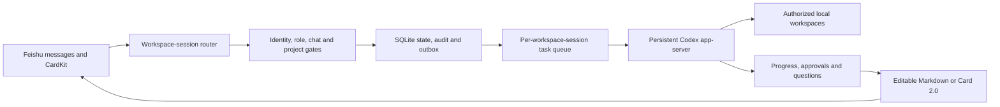

# Architecture

Feishu Codex Bridge is a self-hosted, outbound-only control plane. The bridge opens long-lived connections to Feishu and a local Codex app-server; it does not expose SSH, HTTP, or a webhook port from the developer machine.

## Identity and isolation

- Private chats use the Feishu chat ID as their current workspace-session key.
- Top-level group controls keep the configured `chat` or `member` isolation policy. A top-level ordinary prompt starts a reply thread whose key is `chat_id::topic::root_message_id`; every later message in that reply thread resolves to the same project, queue, preferences, and Codex thread.
- A new group topic copies the top-level project and explicit model/reasoning/sandbox preferences once. It never copies an old Codex thread, temporary full-access lease, pending approval, or unfinished task.
- First-run onboarding is stored per Feishu member and is automatically presented only in private chat, so group work is not interrupted. A single state-driven card renders the device-offline, project-missing, viewer, ready, completed, or dismissed surface; each active surface has one primary action. Team conventions are progressive disclosure rather than a required setup step.
- Topic history is session-owned, while execution authority remains explicit. Tasks store an immutable initiator and a current controller: control can move only through a group handoff, initiator reclaim, or administrator takeover after role and project ACL checks. Viewers cannot start or control Codex work.
- Project ACLs are evaluated after project discovery, so a message can never introduce an arbitrary filesystem path.
- Team dashboards aggregate retained task metadata without rendering prompts, results, diffs, attachments, paths, or raw member IDs.

## Codex lifecycle

One persistent app-server process serves all conversations. The bridge uses native `model/list`, `thread/list`, `thread/resume`, `thread/compact/start`, `turn/start`, `turn/steer`, and `turn/interrupt` methods. A task snapshots its model, reasoning effort, and sandbox mode when it enters the queue, so later settings changes do not mutate an already queued task.

Repository runbooks are parsed as data, not executed as shell scripts. Parameter substitution produces a normal Codex prompt, then the same member, project, model compatibility, sandbox and command policies are applied. A runbook can lower the frozen sandbox but cannot elevate it or pre-authorize external mutations.

## Durability

SQLite WAL stores conversations, tasks, project selections, preferences, onboarding progress, confirmation cards, event deduplication, and device state. A separate outbox table retries text fallbacks. Audit records are bounded to the newest 5,000 entries. Only tasks that can be proven never to have started are restored to the queue; any running, started, or thread-bearing record is interrupted to prevent duplicate commands and file mutations. The task record and CardKit phase are reconciled conservatively at startup. Schema upgrades create a verified SQLite snapshot first and restore it automatically if migration fails.

## Presentation boundary

Questions and read-only analysis own one editable Feishu Markdown reply. That message starts as a compact processing state, is updated in place while Codex works, and becomes a clean final answer without task IDs, model, permission, token, or thread metadata. Routine acknowledgements and validation feedback use the same lightweight native surface.

Native text/post editing uses `PUT /im/v1/messages/:message_id`. Feishu limits one message to 20 edits, so stream deltas are coalesced and progress edits are capped below that limit; a terminal edit is always reserved for the final answer or error state.

Feature cards own controls, project and model settings, approvals, runtime questions, long-running file/code work, reviews, teams, runbooks, and exceptional recovery states. Card rendering remains semantic and state-driven; the durable outbox can fall back to plain text when either Markdown or CardKit delivery fails. This keeps the conversation readable while preserving reliable control for consequential actions.

## Version and adapter boundary

Configuration, persisted state, SQLite, repository policy, runbooks and health files each carry an explicit version. Published packages pin Codex and lark-cli exactly. A safe package upgrade treats the running service as replaceable but the user configuration and data directory as durable: preview, active-task gate, verified backup, doctor, service replacement, health/version verification, then automatic recovery on failure.

Feishu event transport and Codex app-server normalization are internal adapters around the identity/task/policy/persistence domain. They are intentionally not a public plugin SDK in `1.x`; exposing security-critical runtime objects would freeze unsafe implementation details. Future IM or device agents should adapt at these boundaries only after a stable capability, ownership and version-negotiation contract exists.

## Multi-device direction

V5 supports many people on one self-hosted agent node. Multiple machines should not consume the same Feishu application event stream independently because delivery and ownership would be ambiguous. A future hub/agent mode should route tasks through one Feishu-facing hub to outbound-connected device agents, with explicit device identity, project advertisements, end-to-end task ownership, revocation, and no public port on developer laptops.
